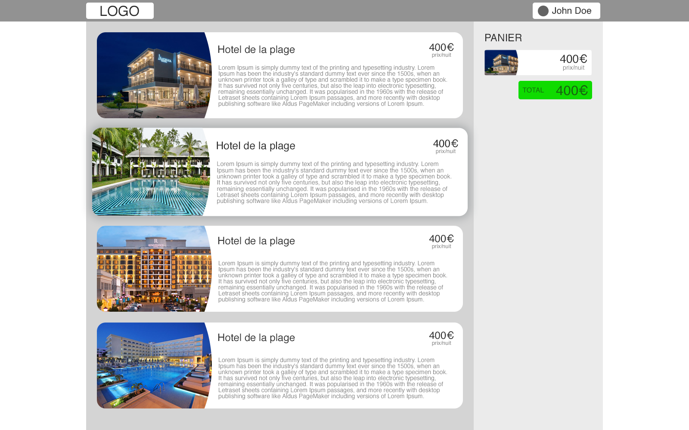

# Test technique React-Redux

_Reprise d'un test envoyé par une société (anonymisée)._

Vous pouvez prendre le temps que vous voulez pour faire le test.
Quelques règles sont énoncées mais une grande liberté est donnée sur le reste des règles (graphiques / fonctionnelles).

## Réaliser une application WEB

### Contexte
 - Une société dispose de plusieurs hotels et souhaite vendre des nuits sur internet,
 - La société souhaite une application robuste qui respecte les bonnes pratiques,
 - L'équipe design propose une 1ere maquette.

### Stack
 - React,
 - Redux,
 - TypeScript est un plus,
 - le reste est libre.

### Règles métiers
 - Un internaute peut commander autant de nuit qu'il veut en même temps (au moins une nuit),
 - Un panier affiche toutes les nuits sélectionnées et le total des coûts,
 - Un email, nom, prénom, et adresse sont demandés afin de passer commande (email obligatoire),
 - Un message de confirmation est affiché à la fin du parcours.

### Étapes du parcours
 1. Choix des nuits
 2. Informations personnelles
 3. Récapitulatif de la commande
 4. Message de confirmation

### Maquette

